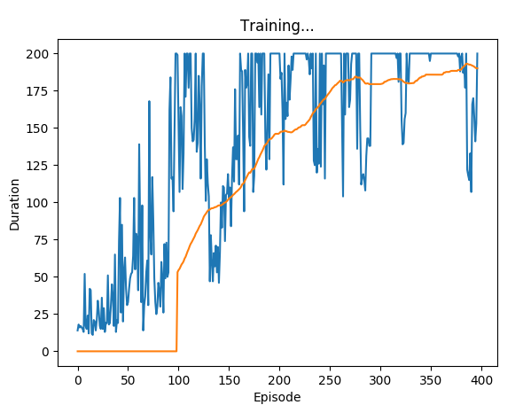

# pytorch-policy-gradient-example

Train an agent for CartPole-v0 using naive Policy Gradient.

Inspired by [Andrej Karpathy's blog](https://karpathy.github.io/2016/05/31/rl/).

Code partly from [Pytorch DQN Tutorial](http://pytorch.org/tutorials/intermediate/reinforcement_q_learning.html)

Solved in 500 episodes (Avg Reward):

